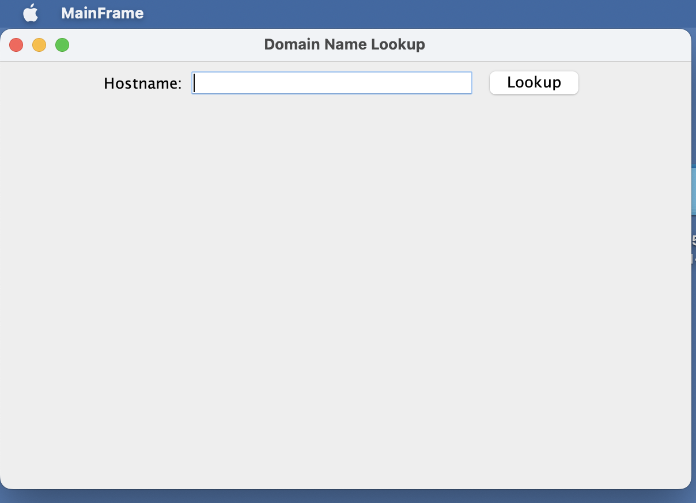
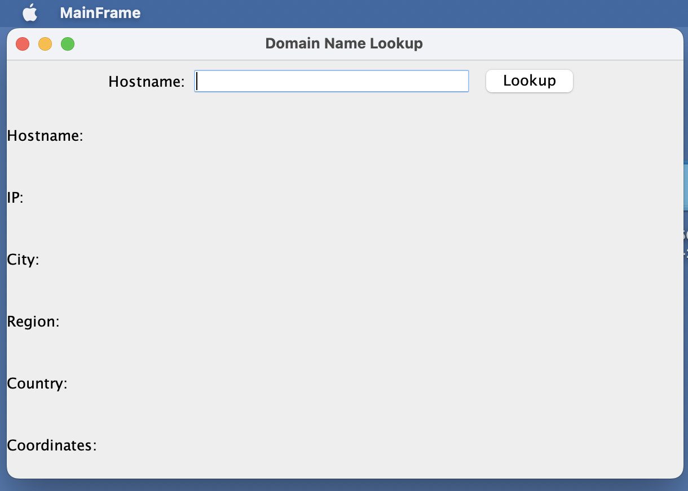
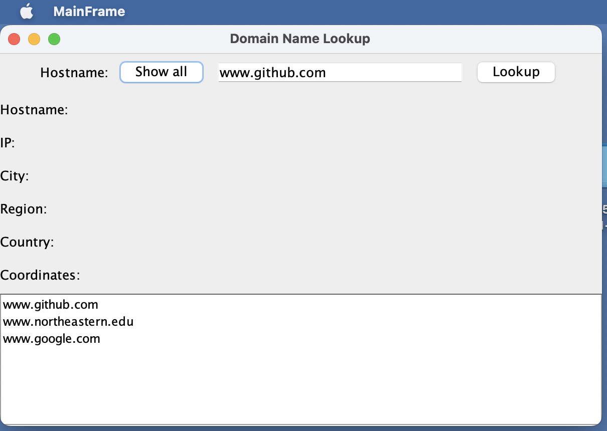
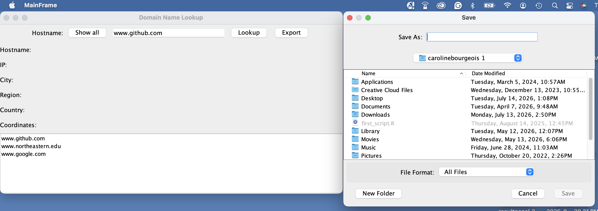
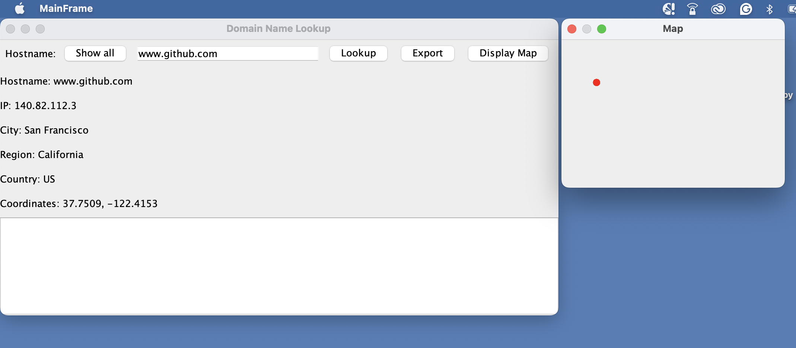
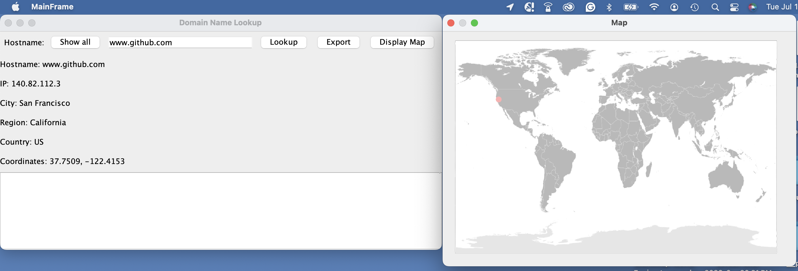

# Testing History

When it comes to testing gui's you often have to document how you tested, and what you did. Use this document to document including screen shots of your testing.

### MainFrame

**main window:** main window setup 

**results panel:** displays result info on the left

**show all button**

typed hostname into search bar → clicked 'Show all' → results displayed at the bottom

**export button**

clicked 'Export' → save options displayed on right

**display map button**

clicked 'Lookup' → clicked 'Display Map'

**display map button w/ real map**

